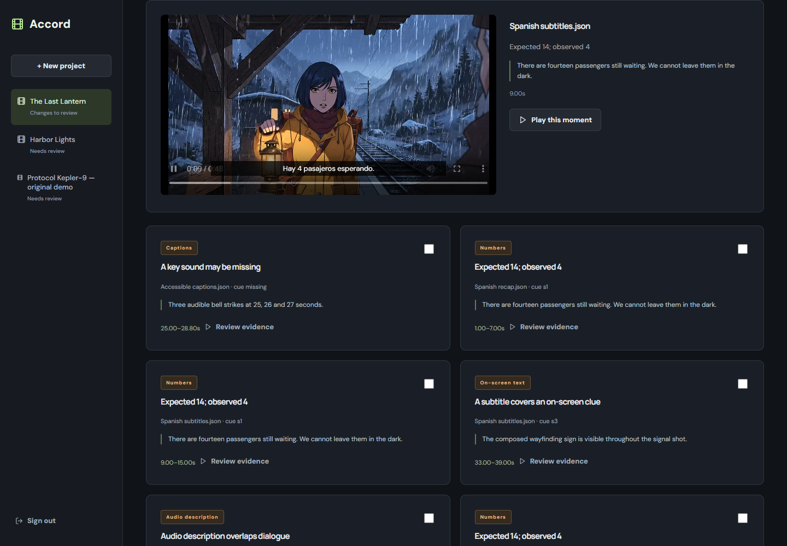
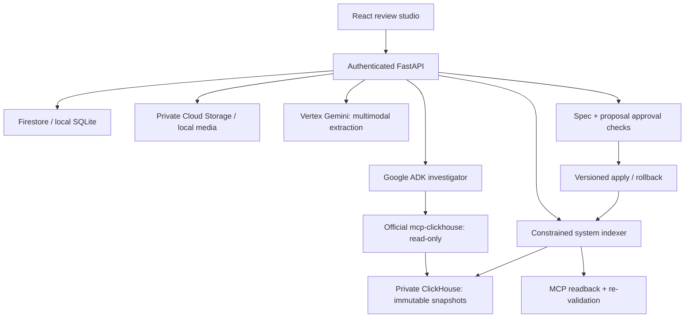

# Accord

**Keep the story intact across every version.**

[Open the review studio](https://storyparity-cus2bs7tpq-uc.a.run.app) · Reviewer access key required for project data.

[Watch the 1:55 walkthrough](https://github.com/Georgexxe/accord/releases/download/v2.2.0/Accord-walkthrough.mp4) · [Transcript](demo/WALKTHROUGH.md)



Accord is a review studio for narrative integrity across localized subtitles, SDH captions, dub transcripts, audio description and derivative edits. It finds bounded story/timing/accessibility divergences, gathers evidence, proposes changes, and requires explicit human approval before applying them.

## Working workflow

1. Create a project with the approved master script; upload a short original master clip and downstream SRT, VTT or JSON tracks.
2. Vertex Gemini analyzes the video/audio and script to extract candidate facts, reveal boundaries, critical sounds, dialogue intervals and on-screen clues.
3. A reviewer edits and approves the exact specification.
4. The system indexes versioned tracks in ClickHouse and reads them back through the **official `mcp-clickhouse` server**. Deterministic checks produce findings; numeric/sound equivalence is labelled for review.
5. A **Google ADK** investigator calls tools for approved evidence, actual indexed cues/lineage and multilingual embedding search. A read-only validation tool checks the candidate against track rules before the model returns a structured repair.
6. A reviewer edits, rejects or approves the exact proposal fingerprint. The server verifies the approved spec and base content, validates the complete resulting track, snapshots every affected asset, then applies changes.
7. Updated versions are indexed and re-read through MCP. Only a successful re-check with no remaining findings produces VERIFIED. Database failure leaves VERIFICATION_PENDING with a retry path.
8. Export corrected SRT/JSON tracks and a versioned JSON delivery report. Rollback refuses to overwrite later edits and restores every affected asset before rechecking.

## Five supported checks

| Check | Evidence and scope |
|---|---|
| Numeric fact divergence | Digits in aligned cues versus an approved numeric fact; review candidate, not general translation grading |
| Premature identity reveal | Approved name/aliases before the master reveal boundary |
| Missing critical SDH sound | Approved sound labels/aliases missing from the covered interval; review equivalent wording |
| Audio-description collision | Exact temporal overlap with approved dialogue intervals |
| Subtitle/clue collision | Overlap between supplied normalized subtitle placement and approved on-screen clue region |

The primary demo is **The Last Lantern**, a 48-second original anime-style short in `demo/lantern/`. **Harbor Lights**, a separate 16-second scene in `demo/harbor/`, provides an independent test. Both use Google Veo, Google Cloud speech, original scripts and synthesized sound. Each package includes clean controls and deliberately defective tracks. These are evaluation inputs, not claims of general translation accuracy. The earlier procedural demo remains as historical test material.

The review interface includes before/after playback, caption text/timing/placement controls, and a connected-version view. Proposed changes stay separate until approved; applied previews use the retained original version. Dub and audio-description previews display text over the original audio, and do not synthesize replacement audio.

Run `node scripts/test_review.cjs` after installing frontend dependencies for the six focused React interaction tests. Regeneration scripts are `animate_lantern.py`, `assemble_lantern.py` and `build_animation_demo.py`; install `scripts/requirements-demo.txt` alongside the backend requirements, and FFmpeg. Google generation requires a billed, authorised Cloud project.

See [animation provenance and regeneration](demo/ANIMATION-PROVENANCE.md).

## Architecture



Model access is Google Cloud only. Embeddings use `gemini-embedding-001`; analytical similarity ranks evidence and does not establish a defect. No service failure is replaced with an invented successful result. The official MCP runs as a subprocess with a separate database account whose `readonly=1` is enforced by ClickHouse.

## Run locally

Python 3.12 and Node.js 22 are supported. Install `backend/requirements.txt` in a virtual environment and run `npm ci` in `frontend/`.

```powershell
uv venv --python 3.12 .venv
uv pip install --python .venv/Scripts/python.exe -r backend/requirements.txt
cd frontend
npm ci
npm run build
cd ..
$env:PYTHONPATH='backend'
$env:STORYPARITY_REVIEWER_TOKEN='<at least 24 random characters>'
.venv/Scripts/python.exe -m uvicorn app.main:app --host 127.0.0.1 --port 8000
```

Open `http://127.0.0.1:8000`. Enter the configured reviewer key; it remains in browser memory. Local state persists under `runtime/` (gitignored). Configure Google Cloud ADC and the ClickHouse variables shown in `.env.example` before extraction/scanning. The app does not automatically load `.env` files.

For the provisioned private cluster, `deploy/local_cloud.py` loads credentials from Secret Manager into memory and uses the authenticated gcloud CLI for refreshable local Google credentials. It requires the documented IAP tunnel. See `deploy/VERIFIED-INFRASTRUCTURE.md` and `deploy/READINESS.md` for configuration, cost-bearing resources, shutdown and release commands.

## Input format

SRT/VTT times must be relative to the uploaded clip or explicitly mapped with the asset's master offset. JSON tracks are arrays:

```json
[{"id":"cue-1","start":10.0,"end":14.0,"text":"Hay 4 supervivientes.","box":{"x":0.3,"y":0.7,"width":0.4,"height":0.15}}]
```

`box` is optional; placement checks require it. `master time = cue time + master_offset`. Choose an existing parent asset for derivatives. Current offset mapping supports linear trims; montage edits should be split into separately mapped segments.

## Validation and evidence

```powershell
.venv/Scripts/python.exe -m pytest -q --basetemp=runtime/pytest
cd frontend
npm run build
```

The default test suite is `backend/tests_v2`. It covers all five known-answer defects and clean controls, persistence, optimistic revisions, exact cue identity, spec/proposal tampering, multi-asset rollback, API authorization, failed cloud calls and pending-verification recovery. External service doubles exist only in unit tests.

Live integration runners:

- `scripts/live_smoke.py`: actual Vertex extraction, actual MCP impossible predicate, ADK investigation and semantic evidence.
- `scripts/live_delivery.py`: original video/audio ingestion, Firestore/media persistence, all five detection classes, live agent repair, MCP verification, export and rollback.

Optional demo regeneration uses `scripts/requirements-demo.txt`, FFmpeg and Google Cloud Text-to-Speech. The drawing/capture helpers target Windows with Arial and Chrome installed; `PLAYWRIGHT_MODULE` can point to an installed Playwright Node module. The supplied master media can be used directly on any supported application host without regenerating it.

See `VALIDATION.md` for measured results and remaining limitations. The release source contains the active implementation; historical simulator files remain preserved separately in the original working copy and are excluded from deployment and release evidence.

## Operational boundaries

This is a single-reviewer application using a high-entropy server-side access key, not multi-tenant identity management. Production serves a public sign-in page; project and media APIs require the reviewer key. Staging also requires Google IAM authentication. Firestore stores bounded project documents (900 KB guard); large catalogs should be split into projects. ClickHouse on the provisioned single VM is persistent but not highly available. Backups and ongoing costs require operator attention.

The tool assists professional review. It does not certify accessibility, guarantee translation quality, synthesize finished dubs, or prove that an unflagged track has no defects. Timing depends on the human-approved spec; semantic ambiguity remains a human decision. Video upload supports MP4/WebM/audio up to 20 MB; tracks up to 1 MB. SRT exports preserve text/timing; JSON exports preserve placement metadata.

## Sources and license

- [Google ADK](https://google.github.io/adk-docs/)
- [Official ClickHouse MCP](https://github.com/ClickHouse/mcp-clickhouse)
- [Google Cloud Text-to-Speech](https://docs.cloud.google.com/text-to-speech/docs/reference/rest/v1/text/synthesize)
- [Agentic Cinema rules](https://agentic-cinema.devpost.com/rules)

MIT licensed; see `LICENSE`. Original synthetic demo provenance is in `demo/PROVENANCE.md`.

For walkthrough rendering, run `scripts/prepare_video_media.py` before `scripts/render_demo.py`. The renderer uses clean desktop stills and selected motion clips, then checks every decoded frame with `scripts/validate_video.py`. Mobile QA runs separately with `STORYPARITY_MOBILE_CHECK=1`; those runs do not produce release recordings.
